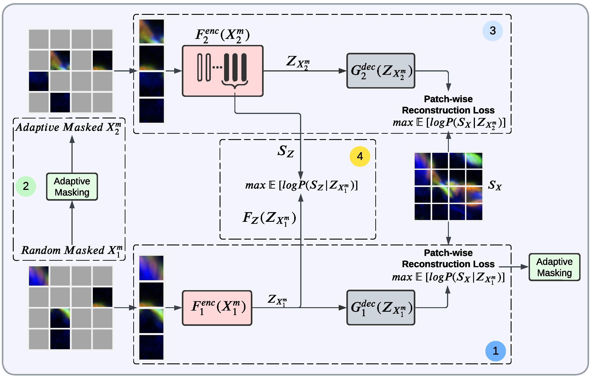
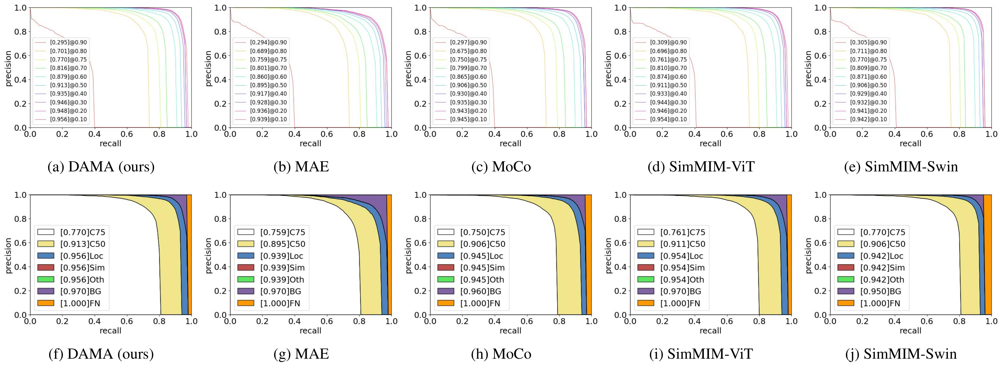
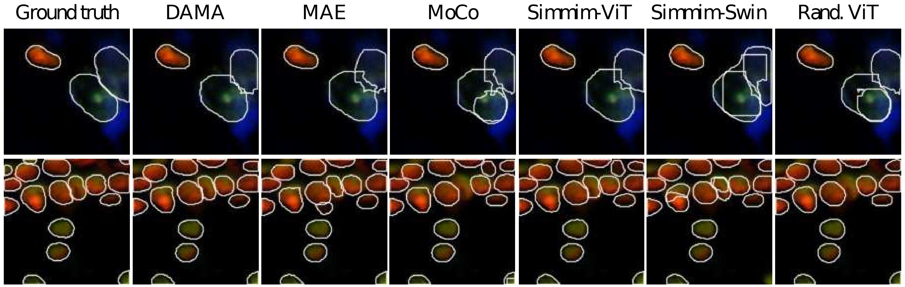
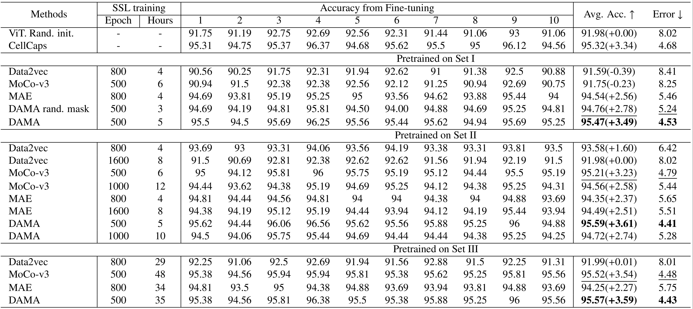
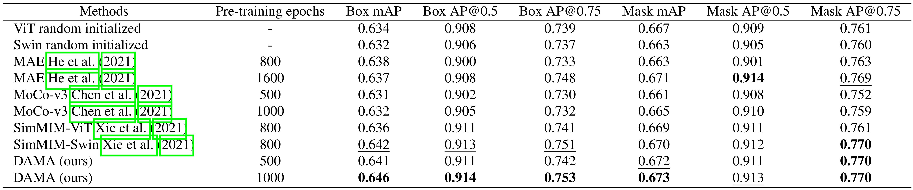
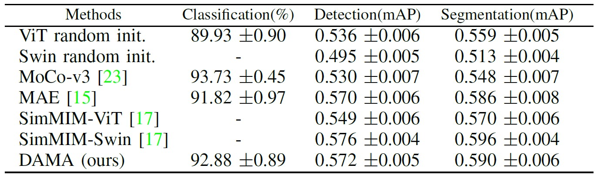
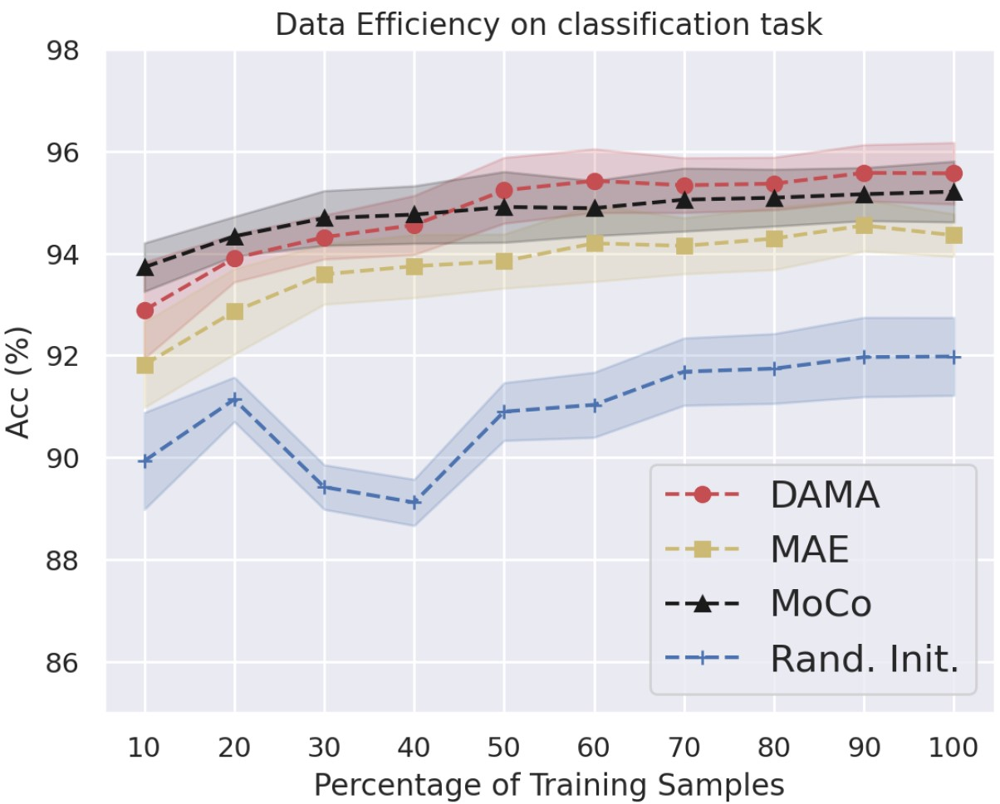
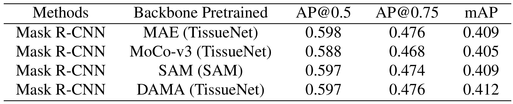
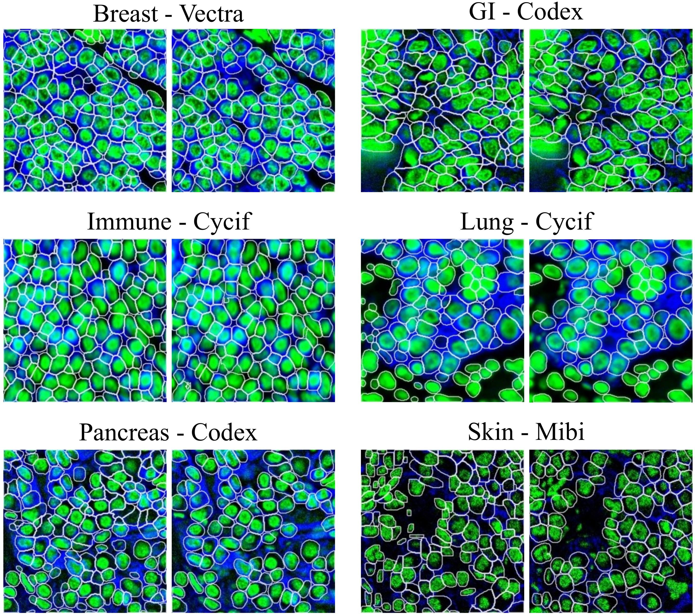
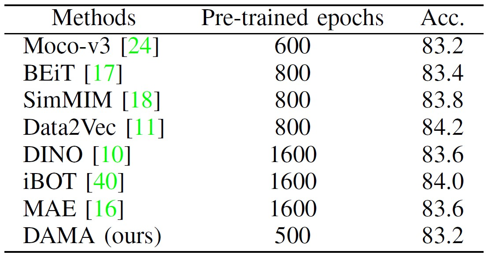

## DAMA - Cellular Data Extraction from Multiplexed Brain Imaging Data using Self-supervised Dual-loss Adaptive Masked Autoencoder
This is a PyTorch/GPU implementation of the paper [Cellular Data Extraction from Multiplexed Brain Imaging Data using Self-supervised Dual-loss Adaptive Masked Autoencoder](https://arxiv.org/abs/2205.05194)

* This repo is based on PyTorch=1.10.1 and timm=0.5.4

## DAMA Overview

<p align="center">

<p align="center"> Overview of DAMA pipeline.
</p>

## Results
Please see the paper for more results.

### Brain Cell datasets

<p align="center">

<p align="center"> Segmentation mask error analysis: overall-all-all Precision-Recall curves.
</p>

<p align="center">

<p align="center"> Visualization of segmentation results on validation set.
</p>

**Cell Classification**

<p align="center">

<p align="center"> Comparisons of finetuning classification results of DAMA and state-of-the-art SSL methods.
</p>

**Cell Segmentation**

<p align="center">

<p align="center"> Comparisons of finetuning segmentation results of DAMA and state-of-the-art SSL methods.
</p>

**Data Efficiency**

<p align="center">


<p align="center"> Data efficiency comparison in terms of the mean and standard deviation. (Left) Using 10% of training data on classification and detection/segmentation tasks. (Right) Using 10%-100% of training data (right) on classification task.
</p>

### TissueNet

To examine the generalizability of DAMA on TissueNet dataset

<p align="center">

<p align="center"> Comparisons results of DAMA and state-of-the-arts on TissueNet Greenwald et al. (2022) dataset.
<p align="center">

<p align="center"> Visualization examples of DAMA’s prediction on the test set of TissueNet dataset.
</p>

### ImageNet-1k
Due to computational resource, DAMA is trained **only once** without any ablation experiment for ImageNet and with similar configuration as for trained the brain cell dataset.

<p align="center">

<p align="center"> Comparisons results of DAMA and state-of-the-arts on ImageNet-1k.
</p>

### Pre-training DAMA
```
python submitit_pretrain.py --arch main_vit_base \
      --batch_size 64 --epochs 500 --warmup_epochs 40 \
      --mask_ratio 0.8 --mask_overlap_ratio 0.5 --last_k_blocks 6 --norm_pix_loss \
      --data_path path_to_dataset_folder \
      --job_dir path_to_output_folder \
      --code_dir code_base_dir \
      --nodes 1 --ngpus 4
```

### Fine-tuning DAMA for cell classification
```
python submitit_finetune.py --arch main_vit_base \
      --batch_size 128 --epochs 150  \
      --data_path path_to_dataset_folder \
      --finetune path_to_pretrained_file \
      --job_dir path_to_output_finetune_folder \
      --code_dir code_base_dir \
      --dist_eval --nodes 1 --ngpus 4
```

### Fine-tuning DAMA for cell segmentation
Please adapt [ViTDet: Exploring Plain Vision Transformer Backbones for Object Detection](https://arxiv.org/abs/2203.16527) from [Detectron2 repo ViTDet](https://github.com/facebookresearch/detectron2/tree/224cd2318fdb45b5e22bbb861ee9711ee52c8b75/projects/ViTDet)


```
@article{ly2022student,
  title={Student Collaboration Improves Self-Supervised Learning: Dual-Loss Adaptive Masked Autoencoder for Multiplexed Immunofluorescence Brain Images Analysis},
  author={Ly, Son T and Lin, Bai and Vo, Hung Q and Maric, Dragan and Roysam, Badri and Nguyen, Hien V},
  journal={arXiv preprint arXiv:2205.05194},
  year={2022}
}
```
