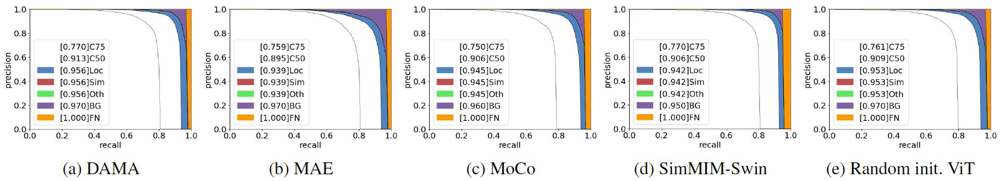
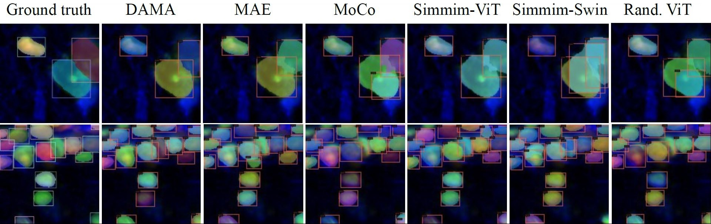

## DAMA - Student Collaboration Improves Self-Supervised Learning: Dual-Loss Adaptive Masked Autoencoder for Multiplexed Immunofluorescence Brain Images Analysis
This is a PyTorch/GPU implementation of the paper [Student Collaboration Improves Self-Supervised Learning: Dual-Loss Adaptive Masked Autoencoder for Multiplexed Immunofluorescence Brain Images Analysis](https://arxiv.org/abs/2205.05194)

* This repo is based on PyTorch=1.10.1 and timm=0.5.4

<p align="center">

Fig. 1. (a) Overview of DAMA pipeline and (b) Information perspective.
</p>

### DAMA utilizes contextual information and performs better than other methods.

<p align="center">

Fig. 2. Segmentation mask error analysis: overall-all-all Precision-Recall curves.
</p>

<p align="center">

Fig. 3. Visualization of segmentation results on validation set.
</p>

Below is the fine-tune result of DAMA compared to other state-of-the-art methods pretrained on **brain cells dataset** and **ImageNet-1k**. 

### 1. Brain Cell datasets
Please see the Supplementary Materials for more results and figures.

**Cell Classification**

|                    | 0     | 1     | 2     | 3     | 4     | 5     | 6     | 7     | 8     | 9     | Avg. &#8593;          | Err. &#8595; |
|--------------------|:-------:|:-------:|:-------:|:-------:|:-------:|:-------:|:-------:|:-------:|:-------:|:-------:|:--------------------------:|:-------------------:|
| Random   init.     | 91.75 | 91.19 | 92.75 | 92.69 | 92.56 | 92.31 | 91.44 | 91.06 | 93    | 91.06 | 91.98(+0.00)             | 8.02              |
| Data2vec 800 (4h)  | 90.56 | 90.25 | 91.75 | 92.31 | 91.94 | 92.62 | 91    | 91.38 | 92.5  | 90.88 | 91.59(-0.39)             | 8.41              |
| MOCO-v3 500 (6h)   | 90.94 | 91.5  | 92.38 | 92.38 | 92.56 | 92.12 | 91.25 | 90.94 | 92.69 | 90.75 | 91.75(-0.23)             | 8.25              |
| MAE 800 (4h)       | 94.69 | 93.81 | 95.19 | 95.25 | 95    | 93.56 | 94.62 | 93.88 | 95.44 | 94    | 94.54(+2.56)             | 5.46              |
| DAMA-rand 500 (3h) | 94.69 | 94.19 | 94.81 | 95.81 | 94.50 | 94.00 | 94.88 | 94.69 | 95.25 | 94.81 | 94.76(+2.78) | 5.24  |
| DAMA 500 (5h)      | 95.5  | 94.5  | 95.69 | 96.25 | 95.56 | 95.44 | 95.62 | 94.94 | 95.69 | 95.25 | ***95.47(+3.49)***      | ***4.53***     |

**Cell Segmentation**

| Methods | Box mAP          | Box mAP@50       | Box mAP@75       | Mask mAP         | Mask mAP@50      | Mask mAP@75 |
|-----------------------------|:------------------:|:------------------:|:------------------:|:------------------:|:------------------:|:-------------:|
| ViT random init.            | 63.4             | 90.8             | 73.9             | 66.7             | 90.9             | 76.1        |
| Swin random init            | 63.2             | 90.6             | 73.7             | 66.3             | 90.5             | 76          |
| MAE 800                     | 63.7             | 90.8             | 74.8             | 67.1             | ***91.4***      | 76.9        |
| MAE 1600                    | 63.8             | 90               | 73.3             | 66.3             | 90.1             | 76.3        |
| MOCO-v3 500                 | 63.2             | 90.5             | 73.2             | 66.5             | 91               | 75.9        |
| MOCO-v3 1000                | 63.1             | 90.2             | 73               | 66.1             | 90.8             | 75.2        |
| SIMMIM-ViT 800              | 63.6             | 91.1             | 74.1             | 66.9             | 91.1             | 76.1        |
| SIMMIM-Swin 800             | 64.2 | 91.3 | 75.1 | 67               | 91.2             | ***77*** |
| DAMA 500                    | 64.1             | 91.1             | 74.2             | 67.2 | 91.1             | ***77*** |
| DAMA 1000                   | ***64.6***    | ***91.4***    | ***75.3***    | ***67.3***    | ***91.3*** | ***77*** |

### 2. Pretrained on ImageNet-1k
Due to computational resource, DAMA is trained **only once** without any ablation experiment for ImageNet and with similar configuration as for trained the brain cell dataset.

| Methods | Pre-trained epochs | Acc.  |
|-----------------------------|:--------------------:|:-------:|
| Moco-v3                     | 600                | 83.2  |
| BEiT                        | 800                | 83.4  |
| SimMIM                      | 800                | 83.8  |
| Data2Vec                    | 800                | 84.2  |
| DINO                        | 1600               | 83.6  |
| iBOT                        | 1600               | 84.0  |
| MAE                         | 1600               | 83.6  |
| Our DAMA                    | 500                | 83.17 |


### Pre-training DAMA
```
python submitit_pretrain.py --arch main_vit_base \
      --batch_size 64 --epochs 500 --warmup_epochs 40 \
      --mask_ratio 0.8 --mask_overlap_ratio 0.5 --last_k_blocks 6 --norm_pix_loss \
      --data_path path_to_dataset_folder \
      --job_dir path_to_output_folder \
      --code_dir code_base_dir \
      --nodes 1 --ngpus 4
```

### Fine-tuning DAMA for cell classification
```
python submitit_finetune.py --arch main_vit_base \
      --batch_size 128 --epochs 150  \
      --data_path path_to_dataset_folder \
      --finetune path_to_pretrained_file \
      --job_dir path_to_output_finetune_folder \
      --code_dir code_base_dir \
      --dist_eval --nodes 1 --ngpus 4
```

### Fine-tuning DAMA for cell segmentation
Please adapt [ViTDet: Exploring Plain Vision Transformer Backbones for Object Detection](https://arxiv.org/abs/2203.16527) from [Detectron2 repo ViTDet](https://github.com/facebookresearch/detectron2/tree/224cd2318fdb45b5e22bbb861ee9711ee52c8b75/projects/ViTDet)


```
@article{ly2022student,
  title={Student Collaboration Improves Self-Supervised Learning: Dual-Loss Adaptive Masked Autoencoder for Multiplexed Immunofluorescence Brain Images Analysis},
  author={Ly, Son T and Lin, Bai and Vo, Hung Q and Maric, Dragan and Roysam, Badri and Nguyen, Hien V},
  journal={arXiv preprint arXiv:2205.05194},
  year={2022}
}
```
